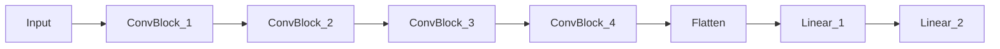

# Histopathologic Cancer Detector

A ML project to predict whether is cancer on image or not.

# The main purpose

To learn the basic approaches in deep learning and machine learning.

# Dataset

The dataset is taken from Kaggle
competition: [Histopathologic Cancer Detection](https://www.kaggle.com/c/histopathologic-cancer-detection/data)

# Base model architecture

The base model is a simple CNN with convolutional layers, activation functions, normalization and fully connected
layers.
For the simplicity of the model code, was decided to move all main layers into ConvBlock class.
Here's the example of the parts ConvBlock consists of:

```python
nn.Conv2d(in_channels, out_channels, kernel_size, stride, padding),
nn.BatchNorm2d(out_channels),
nn.ReLU()
```

The base model architecture is shown below:



# Model variations

|                                                                                V1                                                                                |                                                                                                                    V2                                                                                                                    |                                                                                                                    V3                                                                                                                    | V4                                                                                                                                                                                                                                                                                |
|:----------------------------------------------------------------------------------------------------------------------------------------------------------------:|:----------------------------------------------------------------------------------------------------------------------------------------------------------------------------------------------------------------------------------------:|:----------------------------------------------------------------------------------------------------------------------------------------------------------------------------------------------------------------------------------------:|-----------------------------------------------------------------------------------------------------------------------------------------------------------------------------------------------------------------------------------------------------------------------------------|
| ConvBlock(in, out, 7)<br/>ConvBlock(out, out * 2, 5)<br/>ConvBlock(out * 2, out * 4)<br/>ConvBlock(out * 4, out * 8)<br/>Linear(out * 8, 512)<br/>Linear(512, 1) | ConvBlock(in, out, 7)<br/>MaxPool(2, 2)<br/>ConvBlock(out, out * 2, 5)<br/>MaxPool(2, 2)<br/>ConvBlock(out * 2, out * 4)<br/>MaxPool(2, 2)<br/>ConvBlock(out * 4, out * 8)<br/>MaxPool(2, 2)<br/>Linear(out * 8, 512)<br/>Linear(512, 1) | ConvBlock(in, out, 7)<br/>MaxPool(2, 2)<br/>ConvBlock(out, out * 2, 5)<br/>MaxPool(2, 2)<br/>ConvBlock(out * 2, out * 4)<br/>MaxPool(2, 2)<br/>ConvBlock(out * 4, out * 8)<br/>MaxPool(2, 2)<br/>Linear(out * 8, 128)<br/>Linear(128, 1) | ConvBlock(in, out, 7)<br/>MaxPool(2, 2)<br/>ConvBlock(out, out * 2, 5)<br/>MaxPool(2, 2)<br/>ConvBlock(out * 2, out * 4)<br/>MaxPool(2, 2)<br/>ConvBlock(out * 4, out * 8)<br/>MaxPool(2, 2)<br/>Dropout(0.3)<br/>Linear(out * 8, 64)<br/>ReLU<br/>Dropout(0.3)<br/>Linear(64, 1) |

# Results

| Model | Input size | Weight initialization  | Learning rate | L2 regularization | Accuracy | Loss | 
|:-----:|:----------:|:----------------------:|:-------------:|:-----------------:|:--------:|------|
|  V1   |    8x8     |           He           |    0.0001     |         -         |   0.98   |      |
